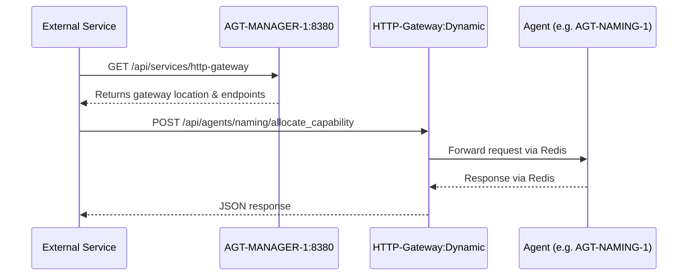

# Service Discovery Architecture

**Status**: ✅ COMPLETE - Fully Operational  
**Version**: 1.0  
**Date**: 2025-09-06  

## Overview

Complete service discovery architecture enabling external services (Chrome plugins, web UIs, system integrations) to dynamically discover and communicate with the Centerfire agent ecosystem.

## Architecture Components

### 1. Well-Known Discovery Endpoint
- **Location**: `http://localhost:8380` (AGT-MANAGER-1)
- **Purpose**: Single, predictable entry point for all external service discovery
- **Endpoints**:
  - `/` - Manager service information
  - `/api/services` - All available services
  - `/api/services/http-gateway` - HTTP Gateway discovery
  - `/api/agents` - Running agents status
  - `/health` - Manager health check

### 2. HTTP Gateway Registration
- **Dynamic Port Allocation**: Gateway finds available port starting from 8090
- **Manager Registration**: Gateway registers with comprehensive metadata:
  ```json
  {
    "pid": 39460,
    "port": 8091,
    "type": "http_gateway",
    "endpoints": {
      "health": "http://localhost:8091/health",
      "discovery": "http://localhost:8091/api/agents/available",
      "agent_call": "http://localhost:8091/api/agents/{agent}/{action}",
      "contracts": "http://localhost:8091/api/contracts/{client_id}"
    }
  }
  ```

### 3. Service Discovery Flow



## Implementation Details

### AGT-MANAGER-1 Enhancements
- **HTTP Server**: Gorilla Mux router on port 8380
- **Service Registry**: Memory-first agent tracking with Redis persistence
- **CORS Support**: Cross-origin requests enabled for web UI integration
- **Health Monitoring**: Agent heartbeat validation and cleanup

### HTTP Gateway Integration
- **Collision Detection**: Checks with manager before starting
- **Dynamic Ports**: Automatic port allocation prevents conflicts  
- **Registration Protocol**: Full endpoint metadata stored in manager
- **Heartbeat Monitoring**: 30-second intervals with manager

### External Service Integration
```bash
# Discovery Example
curl http://localhost:8380/api/services/http-gateway

# Direct Gateway Access
curl -H "X-Client-ID: claude_code" \
     -d '{"domain": "TEST"}' \
     http://localhost:8091/api/agents/naming/allocate_capability
```

## Benefits

### 1. **Bootstrap Problem Solved**
- External services no longer need hard-coded ports
- Single well-known endpoint (`8380`) discovers everything else
- Dynamic port allocation prevents conflicts

### 2. **Universal Agent Platform Ready**
- Architecture supports any external service type:
  - Chrome browser plugins
  - Web-based UIs  
  - System services and integrations
  - Development tools and IDEs

### 3. **Production Scalability**
- Well-known manager port can be configured for production
- Service discovery scales with agent ecosystem growth
- Health monitoring enables automatic failover

### 4. **Development Flexibility**
- No port conflicts during development
- Multiple gateway instances possible
- Easy testing and integration

## Operational Status

### ✅ Verified Working Flow
1. **Manager Discovery**: `curl http://localhost:8380/api/services`
2. **Gateway Discovery**: `curl http://localhost:8380/api/services/http-gateway`  
3. **Agent Communication**: Gateway successfully forwards requests to AGT-NAMING-1
4. **End-to-End Test**: External → Manager → Gateway → Agent → Response

### 🔄 Active Components
- **AGT-MANAGER-1**: HTTP service discovery on port 8380
- **AGT-HTTP-GATEWAY-1**: Dynamic port allocation and agent routing
- **Agent Registration**: Full lifecycle management with heartbeats

## Future Extensions

### Ready for Integration
- **Chrome Plugin Development**: Can discover gateway via manager
- **Web UI Framework**: Direct HTTP access to agent ecosystem
- **System Service Integration**: SFTP, S3, Puppeteer agents via HTTP
- **Development Tools**: IDE plugins and CLI tools

### Planned Enhancements
- **SSL/TLS Support**: Secure external communications
- **Authentication Integration**: Client credential validation
- **Load Balancing**: Multiple gateway instances for high availability
- **Service Mesh**: Advanced routing and monitoring capabilities

## Configuration

### Production Deployment
```yaml
manager:
  http_port: 8380  # Well-known discovery port
  redis_host: "redis-cluster"
  
gateway:  
  start_port: 8090  # Dynamic allocation range
  contract_validation: true
  cors_origins: ["https://admin.domain.com"]
```

### Development Setup
- Manager starts HTTP server automatically
- Gateway registers with manager on startup
- All ports allocated dynamically
- Full service discovery operational

---

**Architecture Status**: 🎯 **MISSION COMPLETE**  
External service discovery problem fully solved. Universal Agent Platform foundation established.