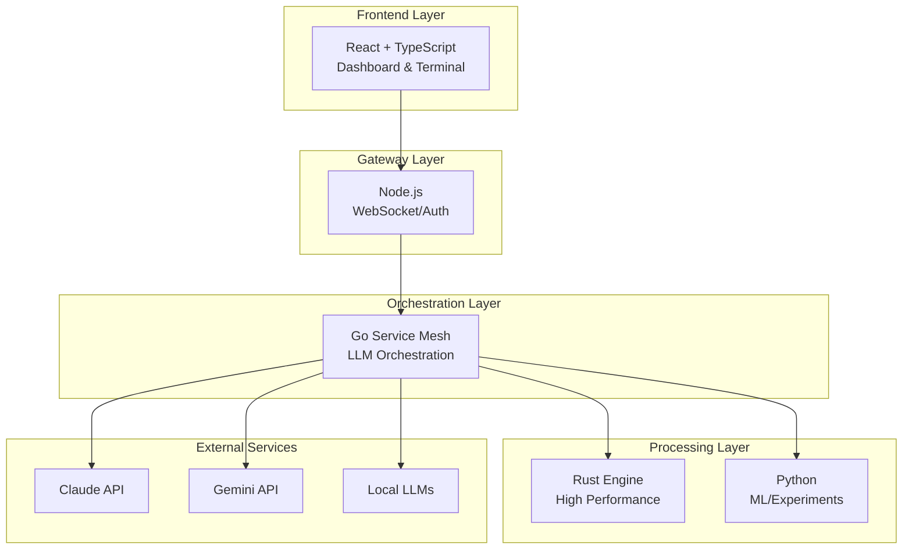

# Best-of-Breed Architecture Design
*Date: 2025-09-05*
*Decision: Pivot to multi-language, AI-maintained architecture*

## Core Insight
With AI-powered code maintenance (Claude, Copilot, etc.), traditional "single language" team constraints no longer apply. We can use the optimal language for each component.

## Architecture Overview



## Language Decisions

### Go - Orchestration Brain
**Why Go:**
- Goroutines perfect for concurrent LLM calls
- Channels for elegant coordination
- Built for network services
- Fast compilation, easy deployment

**Responsibilities:**
- LLM connection pooling
- Request routing and orchestration
- Token management and optimization
- Circuit breakers and rate limiting
- Context window management

### Rust - Performance Core
**Why Rust:**
- Memory safety without GC
- Zero-cost abstractions
- Better than C++ for safety
- Growing LLM ecosystem

**Responsibilities:**
- Stream processing
- Context compression
- Token counting/windowing
- Binary protocol handling
- High-throughput data pipelines

### Node.js - Web Interface
**Why Node:**
- Native web ecosystem
- WebSocket/SSE built-in
- Excellent LLM SDKs
- Frontend/backend TypeScript sharing

**Responsibilities:**
- WebSocket server
- Authentication
- Session management
- Static file serving
- Real-time updates

### React - Dashboard UI
**Why React:**
- Component ecosystem
- Real-time updates
- xterm.js for terminal
- Chart.js/D3 for monitoring

**Responsibilities:**
- Terminal emulation
- Performance dashboards
- Alert management
- Configuration UI

## SemDoc Integration Strategy

### 1. Language-Specific Implementations
```go
// Go: SemDoc as struct tags
type LLMRequest struct {
    Prompt  string `semdoc:"User prompt to send to LLM" required:"true"`
    Model   string `semdoc:"Target model identifier" enum:"claude,gemini,local"`
    Context []byte `semdoc:"Compressed context window" format:"binary"`
}
```

```rust
// Rust: SemDoc as attributes
#[derive(SemDoc)]
#[semdoc(description = "High-performance token processor")]
struct TokenProcessor {
    #[semdoc(desc = "Current token count", range = "0..150000")]
    token_count: usize,
}
```

```typescript
// TypeScript: SemDoc as decorators
@SemDoc({ description: "WebSocket message handler" })
class MessageHandler {
    @SemDoc({ returns: "Processed message or error" })
    async process(msg: string): Promise<Result> {}
}
```

### 2. Cross-Language Contract Definition
```yaml
# contracts/llm-orchestration.yaml
contract: LLMOrchestration
version: 1.0.0
participants:
  - service: go-orchestrator
    role: coordinator
  - service: rust-processor
    role: executor
  - service: node-gateway
    role: interface

operations:
  process_request:
    input:
      prompt: string
      context_id: uuid
    output:
      response: string
      tokens_used: integer
    errors:
      - token_limit_exceeded
      - model_unavailable
```

### 3. Automatic Documentation Generation
- Each language generates its own SemDoc
- Central aggregator combines into unified docs
- AI can understand component interactions
- Runtime validation across services

## Open Source Components to Adapt

### Go Orchestration
- **Ollama** - Local LLM management (Go)
- **Temporal** - Workflow orchestration
- **Caddy** - Reverse proxy with auto-HTTPS
- **chi** - HTTP router

### Rust Performance
- **Candle** - Rust ML framework
- **Tokenizers** - HuggingFace tokenizers in Rust
- **Tantivy** - Full-text search engine

### Node.js/React
- **Xterm.js** - Terminal in browser
- **Socket.io** - Real-time communication
- **Recharts** - Dashboard charts
- **Monaco Editor** - VS Code editor component

### Existing Projects to Study/Fork
- **Continue.dev** - Open source AI code assistant
- **Tabby** - Self-hosted AI coding assistant
- **LocalAI** - Local LLM API
- **LangChain** - LLM orchestration patterns

## Memory & Logging Strategy

### Mem0 Integration
```python
# Update mem0 with architecture decisions
memory.add(
    "Architecture pivoted to best-of-breed approach",
    metadata={
        "decision_date": "2025-09-05",
        "languages": ["Go", "Rust", "Node.js", "React"],
        "rationale": "AI-maintained code enables optimal language per component"
    }
)
```

### Unified Logging
```yaml
# logging-config.yaml
collectors:
  go:
    format: json
    output: stdout
    level: debug
  rust:
    format: json
    output: stdout
    level: trace
  node:
    format: json
    output: stdout
    level: info

aggregator:
  type: fluentd
  outputs:
    - elasticsearch
    - file: /logs/unified.json
    - stream: dashboard-websocket
```

## Development Phases

### Phase 1: Foundation (Current)
- [x] Document architecture
- [ ] Set up Go orchestrator skeleton
- [ ] Create React dashboard scaffold
- [ ] Implement basic WebSocket bridge

### Phase 2: Integration
- [ ] Connect to local LLMs (Ollama)
- [ ] Add Claude/Gemini APIs
- [ ] Implement request routing
- [ ] Basic context management

### Phase 3: Enhancement
- [ ] Rust stream processor
- [ ] Advanced token management
- [ ] Performance monitoring
- [ ] SemDoc generation

### Phase 4: Intelligence
- [ ] Auto-routing based on request type
- [ ] Cost optimization
- [ ] Context compression
- [ ] Predictive caching

## Key Innovation: AI-First Maintenance

This architecture assumes:
1. **AI writes most code** - We guide, AI implements
2. **Language barriers irrelevant** - AI knows all languages
3. **Documentation auto-generated** - SemDoc everywhere
4. **Self-improving** - System can modify itself

## Success Metrics
- Request latency < 100ms for routing
- Support 10+ concurrent LLM calls
- 90% cache hit rate for common requests
- Zero memory leaks in Rust components
- 100% SemDoc coverage for public APIs

## Next Steps
1. Research and select open source components
2. Create Go orchestrator with Ollama integration
3. Build React dashboard with xterm.js
4. Implement WebSocket bridge in Node.js