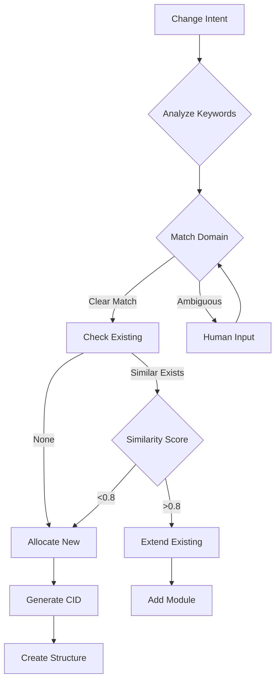

# How AI Makes Autonomous Naming Decisions

## Real-World Scenarios for Your Team

### Scenario 1: Mobile UI Request

**AI receives:** "We need a mobile version of the dashboard"

**AI's Decision Process:**
```yaml
1. Analyze Intent:
   - Keywords: "mobile", "dashboard"
   - Existing: CAP-UI-001 (web dashboard)
   
2. Domain Selection:
   - Could be: UI (interface) or MOB (mobile-specific)
   - Decision: MOB because mobile has unique constraints
   
3. Check Existing:
   - Query: Any mobile capabilities?
   - Result: None found
   
4. Allocate Name:
   - Domain: MOB
   - Next sequence: 001
   - Result: CAP-MOB-001
   
5. Generate IDs:
   - CID: cid:centerfire:capability:01J9F8B3R6T8ZX4K9M2Q7N5YHW
   - Slug: CAP-MOB-001
   - Directory: CAP-MOB-001__01J9F8B3/
```

**Created Structure:**
```
/capabilities/
  CAP-MOB-001__01J9F8B3/
    .id                         # Contains CID
    semdoc.yaml                 # References CAP-UI-001 as dependency
    impl/
      ui/
        react-native/           # Mobile-specific implementation
        ios/
        android/
```

### Scenario 2: ADA Compliance Request

**AI receives:** "Add accessibility features for screen readers"

**AI's Decision Process:**
```yaml
1. Analyze Intent:
   - Keywords: "accessibility", "screen readers"
   - This is a cross-cutting concern
   
2. Domain Selection:
   - Check domains: ADA exists for accessibility
   - Decision: ADA domain
   
3. Check Existing:
   - Query: Any ADA capabilities?
   - Result: None found
   
4. Decision Point:
   - Option A: Add to CAP-UI-001 (accessibility in UI)
   - Option B: Create CAP-ADA-001 (accessibility as capability)
   - Choice: B - ADA affects multiple capabilities
   
5. Allocate Name:
   - Result: CAP-ADA-001
```

### Scenario 3: Another Authentication Method

**AI receives:** "Implement biometric authentication"

**AI's Decision Process:**
```yaml
1. Analyze Intent:
   - Keywords: "biometric", "authentication"
   - Core purpose: Authentication
   
2. Domain Selection:
   - Clear match: AUTH domain
   
3. Check Existing:
   - Found: CAP-AUTH-001 (JWT authentication)
   - Similarity: High (both authentication)
   
4. Decision Point:
   - Biometric is very different from JWT
   - But same domain (AUTH)
   - Decision: Create CAP-AUTH-002
   
5. Reasoning:
   - Different enough to warrant new capability
   - But same domain keeps auth together
```

## The Domain Registry in Action

```python
# AI's domain matching logic
def determine_domain(description: str) -> str:
    domain_keywords = {
        'MOB': ['mobile', 'ios', 'android', 'react-native', 'phone', 'tablet'],
        'ADA': ['accessibility', 'ada', 'wcag', 'aria', 'screen-reader', 'a11y'],
        'UI': ['interface', 'frontend', 'dashboard', 'display', 'view', 'gui'],
        'UX': ['experience', 'usability', 'interaction', 'behavior'],
        'AUTH': ['authentication', 'authorization', 'login', 'oauth', 'jwt', 'session'],
        'DATA': ['database', 'storage', 'persistence', 'cache', 'query'],
        'LLM': ['ai', 'model', 'prompt', 'embedding', 'inference'],
    }
    
    scores = {}
    for domain, keywords in domain_keywords.items():
        score = sum(1 for kw in keywords if kw in description.lower())
        if score > 0:
            scores[domain] = score
    
    if not scores:
        return prompt_human_for_domain(description)
    
    return max(scores, key=scores.get)
```

## Sequence Number Allocation

```sql
-- AI queries Neo4j for next number
MATCH (c:Capability)
WHERE c.slug STARTS WITH 'CAP-AUTH-'
RETURN MAX(toInteger(substring(c.slug, -3))) as last_number

-- Result: 1
-- Therefore: Next is CAP-AUTH-002
```

### Smart Allocation Rules:
- **001-099**: Core capabilities (most important)
- **100-199**: Extended features
- **200-299**: Experimental
- **900-999**: Legacy/deprecated

## When AI Asks for Human Help

### Scenario: Ambiguous Domain
```yaml
AI: "Creating capability for 'real-time collaboration'"

Analysis:
  Could be NET (networking/websockets)
  Could be UI (collaborative interface)
  Could be DATA (shared state management)
  
Confidence: 0.6 (below 0.7 threshold)

PROMPT TO HUMAN:
  "Real-time collaboration capability detected.
   Primary focus:
   1. NET - Network protocols and sync
   2. UI - Collaborative interface components  
   3. DATA - Shared state management
   Please specify primary domain."
```

### Scenario: High Similarity
```yaml
AI: "Creating capability for 'user authentication'"

Found: CAP-AUTH-001 "Authentication Service"
Similarity: 0.92 (very high)

PROMPT TO HUMAN:
  "Very similar to existing CAP-AUTH-001.
   Options:
   1. Extend CAP-AUTH-001 with new module
   2. Create CAP-AUTH-002 (if significantly different)
   3. Provide more distinguishing details"
```

## The Complete Decision Flow



## For Your Team: Key Points

### 1. **Domains Are Predefined**
```yaml
UI, UX, ADA, MOB, AUTH, DATA, LLM, NET, SEC, TEST, DEPLOY
```
These are the ONLY valid domains. New domains require architectural review.

### 2. **AI Never Guesses Randomly**
- Uses keyword matching
- Checks similarity scores
- Queries existing capabilities
- Asks human when uncertain

### 3. **Sequence Numbers Are Managed**
```python
# Not random!
next_number = last_used_in_domain + 1
```

### 4. **CIDs Are Generated Once**
```python
import ulid
cid = f"cid:centerfire:capability:{ulid.new()}"
# This NEVER changes, even if renamed
```

### 5. **Conflicts Are Prevented**
- Semantic similarity check
- Domain boundary enforcement
- Sequence number allocation
- Directory uniqueness (ULID suffix)

## Example: Complete Autonomous Creation

**Input:** "Create API rate limiting"

**AI's Complete Process:**
```bash
# 1. Determine domain
Keywords: "API", "rate limiting"
Domain: NET (networking)

# 2. Check existing
Query: CAP-NET-* capabilities
Found: None

# 3. Allocate identifiers
Slug: CAP-NET-001
CID: cid:centerfire:capability:01J9F8C4S7U9AY5L0N3R8Q6ZKX
Dir: CAP-NET-001__01J9F8C4

# 4. Create structure
mkdir -p capabilities/CAP-NET-001__01J9F8C4/impl/service/go
echo "cid:centerfire:capability:01J9F8C4S7U9AY5L0N3R8Q6ZKX" > .id

# 5. Generate contract
cat > semdoc.yaml << EOF
capability: CAP-NET-001
name: "API Rate Limiting"
domain: NET
purpose: "Control request rates per client"
EOF

# 6. Update catalog
Add to /semdoc/catalog.yaml

# 7. Update Neo4j
CREATE (c:Capability {
  cid: "cid:centerfire:capability:01J9F8C4S7U9AY5L0N3R8Q6ZKX",
  slug: "CAP-NET-001",
  domain: "NET"
})

# 8. Commit
git add capabilities/CAP-NET-001__01J9F8C4
git commit -m "CAP-NET-001/feat: Initialize API rate limiting capability"
```

## The Guarantee to Your Team

When AI creates a capability autonomously:
1. **It follows the rules** (domain registry, sequence allocation)
2. **It checks for duplicates** (semantic similarity)
3. **It asks when uncertain** (confidence < 0.7)
4. **It's auditable** (decision reasoning logged)
5. **It's reversible** (aliases support renaming)

This isn't magic - it's deterministic, rule-based, and auditable.
The AI can't "make up" names any more than it can make up syntax.
It follows the contract, period.