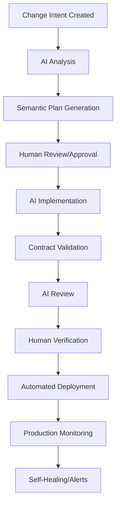

# AI-Native Software Development Life Cycle (SDLC)

## Overview
A post-Agile methodology where AI assistants are first-class participants in development, replacing traditional tickets with semantic Change Intents and enabling continuous, AI-driven development cycles.

## Core Paradigm Shift

### From Human-Centric to AI-Native
Traditional SDLC → AI-Native SDLC:
- **Requirements**: User stories → Semantic contracts
- **Planning**: Sprint planning → Continuous intent processing
- **Development**: Human coding → AI generation with human review
- **Testing**: Manual + automated → Contract validation + oracles
- **Deployment**: Release cycles → Continuous semantic deployment
- **Maintenance**: Bug fixes → Self-healing + intent refinement

## Key Components

### 1. Change Intents (Replacing Tickets)

Instead of tickets describing work to be done, Change Intents describe desired state changes:

```yaml
change_intent:
  id: "CI-2024-001"
  type: "capability_addition"
  
  current_state:
    description: "System cannot process refunds automatically"
    contracts: ["current payment.yaml contracts"]
    tests: ["existing test coverage"]
  
  desired_state:
    description: "System processes refunds within SLA"
    contracts:
      - "refund processing < 30 seconds"
      - "audit trail for all refunds"
      - "notification sent to user"
    acceptance_criteria:
      - "handles partial refunds"
      - "supports multiple payment methods"
      - "maintains transaction integrity"
  
  constraints:
    backward_compatibility: required
    performance_impact: "< 5% degradation"
    security: "PCI compliant"
  
  ai_planning:
    estimated_complexity: "medium"
    suggested_approach: "extend payment service"
    impact_analysis: ["3 services affected", "2 database changes"]
```

### 2. AI Development Roles

#### Semantic Engineer (Human)
- Defines Change Intents and contracts
- Reviews AI-generated implementations
- Makes architectural decisions
- Handles edge cases AI cannot resolve

#### AI Implementation Agent
- Generates code from Change Intents
- Ensures contract compliance
- Runs test oracles
- Performs impact analysis
- Suggests optimizations

#### AI Review Agent
- Reviews generated code for quality
- Checks security vulnerabilities
- Validates performance budgets
- Ensures style consistency

### 3. Development Flow



## Development Phases

### Phase 1: Intent Capture
Capturing the desired change in semantic terms:

```yaml
intent_capture:
  source: "customer_feedback | business_requirement | technical_debt"
  
  semantic_analysis:
    - extract_entities: ["user", "refund", "payment_method"]
    - identify_operations: ["process", "validate", "notify"]
    - determine_constraints: ["time", "compliance", "consistency"]
  
  validation:
    - feasibility_check: "Can this be implemented?"
    - conflict_detection: "Does this conflict with existing intents?"
    - priority_scoring: "Business value vs complexity"
```

### Phase 2: Semantic Planning
AI generates implementation plan:

```yaml
semantic_plan:
  generated_by: "AI Planning Agent"
  
  steps:
    1:
      action: "Extend payment service contract"
      rationale: "Refunds are payment operations"
      changes:
        - file: "services/payment/contracts.yaml"
        - type: "add refund operation"
    
    2:
      action: "Implement refund processor"
      rationale: "New business logic needed"
      changes:
        - file: "services/payment/refund.py"
        - type: "new implementation"
    
    3:
      action: "Add database migrations"
      rationale: "Track refund history"
      changes:
        - file: "migrations/add_refund_table.sql"
        - type: "schema change"
  
  risk_assessment:
    - risk: "Payment gateway compatibility"
      mitigation: "Test with all configured gateways"
    - risk: "Race conditions in concurrent refunds"
      mitigation: "Use database locks"
```

### Phase 3: AI Implementation
Code generation from semantic plan:

```python
# Generated from Change Intent CI-2024-001
# @semblock
# contract:
#   intent_id: "CI-2024-001"
#   generated_at: "2024-11-15T10:00:00Z"
#   validation_status: "pending_review"
#   performance:
#     p95: "25s"  # Within 30s requirement
#   effects:
#     writes: ["database.refunds", "audit.log"]
#     calls: ["payment_gateway.refund", "notification.send"]

class RefundProcessor:
    """AI-generated implementation for automated refund processing"""
    
    async def process_refund(self, transaction_id: str, amount: Decimal) -> RefundResult:
        # Contract validation
        assert await self._validate_transaction(transaction_id)
        assert amount > 0 and amount <= self._get_max_refundable(transaction_id)
        
        # Implementation generated from contracts
        async with self.db.transaction():
            # ... generated code ...
```

### Phase 4: Continuous Validation
Ongoing contract enforcement:

```yaml
continuous_validation:
  pre_commit:
    - validate_against_intent
    - check_contract_compliance
    - run_test_oracles
  
  ci_pipeline:
    - full_contract_validation
    - performance_benchmarks
    - security_scanning
  
  production:
    - monitor_contract_violations
    - track_intent_completion
    - measure_business_metrics
```

## AI-Native Practices

### 1. Semantic Code Review
AI agents perform initial review:

```yaml
ai_review_process:
  static_analysis:
    - contract_compliance
    - code_quality_metrics
    - security_vulnerabilities
    - performance_antipatterns
  
  semantic_analysis:
    - intent_alignment: "Does code fulfill the Change Intent?"
    - contract_coverage: "Are all contracts satisfied?"
    - test_coverage: "Are test oracles comprehensive?"
  
  suggestions:
    - optimizations: ["Use cache here", "Parallelize this operation"]
    - improvements: ["Add error handling", "Improve naming"]
    - risks: ["Potential deadlock", "Missing validation"]
```

### 2. Self-Documenting Code
Code that explains itself to AI:

```python
# @semblock
# purpose: "Calculate customer lifetime value for segmentation"
# business_context: "Used for premium tier qualification"
# data_flow:
#   inputs: ["purchase_history", "engagement_metrics"]
#   outputs: ["ltv_score", "confidence_interval"]
#   side_effects: ["updates customer.ltv_cache"]

def calculate_customer_ltv(customer_id: str) -> LTVResult:
    """
    Human-readable: Calculate the lifetime value of a customer
    
    Machine-readable: See @semblock above
    """
    # Implementation with inline semantic hints
```

### 3. Continuous Learning
System improves through operation:

```yaml
learning_pipeline:
  collect:
    - successful_implementations
    - failed_attempts
    - performance_metrics
    - user_feedback
  
  analyze:
    - pattern_extraction: "What worked well?"
    - antipattern_detection: "What failed?"
    - optimization_opportunities: "What can be improved?"
  
  update:
    - refine_generation_models
    - update_contract_templates
    - improve_planning_algorithms
```

## Workflow Patterns

### 1. Exploratory Development
AI assists in discovering solutions:

```yaml
exploration_workflow:
  human: "I need to handle rate limiting"
  
  ai_response:
    options:
      - token_bucket: "Good for burst traffic"
      - sliding_window: "Smooth rate limiting"
      - fixed_window: "Simple but has edge cases"
    
    recommendation: "token_bucket"
    rationale: "Your traffic pattern shows bursts"
    implementation_sketch: "..."
  
  human: "Let's go with token bucket"
  
  ai_action: "Generate full implementation with contracts"
```

### 2. Specification-First Development
Contracts drive implementation:

```yaml
specification_workflow:
  1_human_specifies:
    contracts:
      - "must handle 1000 requests/second"
      - "fair scheduling across tenants"
      - "graceful degradation under load"
  
  2_ai_generates:
    - implementation_options: 3
    - tradeoff_analysis: "performance vs fairness"
    - recommended_approach: "weighted fair queuing"
  
  3_human_selects:
    choice: "option 2 with modifications"
  
  4_ai_implements:
    - complete_code_generation
    - test_oracle_creation
    - documentation_generation
```

### 3. Remediation Workflow
AI-driven bug fixing:

```yaml
remediation_workflow:
  trigger: "Contract violation detected in production"
  
  ai_analysis:
    - root_cause: "Race condition in cache update"
    - affected_contracts: ["consistency", "performance"]
    - impact: "0.01% of requests affected"
  
  ai_proposal:
    - fix_approaches: ["Add locking", "Use CAS operation"]
    - recommendation: "CAS operation (lock-free)"
    - rollback_plan: "Feature flag controlled"
  
  human_approval: "Approved with monitoring"
  
  ai_implementation:
    - generate_fix
    - create_tests
    - deploy_with_monitoring
```

## Metrics and KPIs

### Development Velocity
- **Change Intents completed/week**
- **AI implementation acceptance rate**
- **Contract violation rate**
- **Time from intent to production**

### Quality Metrics
- **Contract compliance score**
- **Test oracle coverage**
- **Production incident rate**
- **Self-healing success rate**

### AI Effectiveness
- **Code generation accuracy**
- **Review finding relevance**
- **Planning accuracy**
- **Learning rate improvement**

## Migration Strategy

### Level 0: AI-Assisted
- Humans write code
- AI provides suggestions
- Traditional ticketing system

### Level 1: AI-Partnered
- AI generates boilerplate
- Humans write business logic
- Hybrid intent/ticket system

### Level 2: AI-First
- AI generates most code
- Humans review and guide
- Change Intents replace tickets

### Level 3: AI-Native
- AI handles routine development
- Humans focus on architecture
- Semantic contracts drive everything

### Level 4: Autonomous
- AI handles most changes independently
- Humans set policy and constraints
- Self-evolving systems

## Tools and Infrastructure

### Required Components
1. **Semantic Code Store**: Version control with semantic understanding
2. **Contract Engine**: Validates and enforces contracts
3. **AI Development Agent**: Generates and reviews code
4. **Intent Processing System**: Manages Change Intents
5. **Continuous Validation Pipeline**: Ensures compliance
6. **Monitoring and Learning System**: Improves over time

### Integration Points
- **IDE Integration**: AI assistance in development environment
- **CI/CD Integration**: Automated validation and deployment
- **Monitoring Integration**: Production contract tracking
- **Knowledge Base**: Accumulated learning and patterns

## Challenges and Solutions

### Challenge 1: AI Hallucination
**Problem**: AI generates incorrect code
**Solution**: Contract validation + test oracles + human review

### Challenge 2: Complex Business Logic
**Problem**: AI struggles with nuanced requirements
**Solution**: Semantic Engineers handle complex cases

### Challenge 3: Legacy System Integration
**Problem**: Existing code lacks semantic information
**Solution**: Gradual migration with AI-assisted annotation

### Challenge 4: Regulatory Compliance
**Problem**: Legal requirements need human oversight
**Solution**: Compliance contracts with mandatory human review

## Future Evolution

### Near-term (1-2 years)
- Widespread Change Intent adoption
- AI handling 60% of routine changes
- Self-documenting codebases

### Medium-term (3-5 years)
- Fully autonomous development teams
- AI architects designing systems
- Natural language as primary interface

### Long-term (5+ years)
- Self-evolving software systems
- AI-to-AI collaboration protocols
- Human role primarily strategic

---

*This document outlines the transformation from traditional software development to an AI-native approach where artificial intelligence is a primary participant in the development process, not just a tool.*