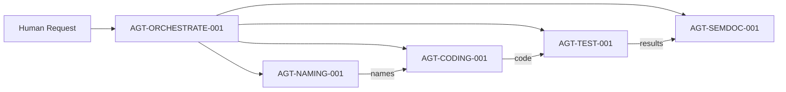

# Centerfire Intelligence - Agent-First Implementation Plan

## Core Insight: Build Agents, Not Services

Everything is an agent. Agents build agents. The system bootstraps itself.

## Phase 0: The Genesis Block (Manual - One Time Only)

### Build AGT-BOOTSTRAP-001
The ONLY thing we build manually. This agent can create all other agents.

```python
# /agents/AGT-BOOTSTRAP-001__manual/agent.py
class BootstrapAgent:
    def create_agent(self, spec):
        # Creates other agents from specifications
        # This is our prime mover
```

## Phase 1: Core Agent Creation (Iterations 1-5)

### Iteration 1: Bootstrap Creates Naming Agent
```yaml
AGT-NAMING-001:
  created_by: AGT-BOOTSTRAP-001
  purpose: "Exclusive authority over all naming decisions"
  capabilities:
    - Allocate CIDs
    - Manage sequences  
    - Validate names
```

### Iteration 2: First Collaboration
Bootstrap + Naming create Structure Agent together:
- Naming provides: AGT-STRUCT-001
- Bootstrap provides: Creation mechanism

### Iteration 3: Documentation Agent
```yaml
AGT-SEMDOC-001:
  purpose: "Creates and maintains semantic documentation"
  needs: [AGT-NAMING-001, AGT-STRUCT-001]
```

### Iteration 4: Code Generation Agent
```yaml
AGT-CODING-001:
  purpose: "Generates code from specifications"
  uses: Claude/GPT API initially
  learns_from: Accepted code patterns
```

### Iteration 5: Test Agent
```yaml
AGT-TEST-001:
  purpose: "Generates and runs tests"
  validates: All agent outputs
```

## Phase 2: Agent Swarm Formation (Iterations 6-10)

### The Swarm Emerges
With core agents running, they start creating specialized agents:

```yaml
AGT-GRAPH-001:    # Neo4j operations
AGT-VECTOR-001:   # Embeddings and similarity
AGT-CACHE-001:    # Redis operations
AGT-AUTH-001:     # Authentication logic
AGT-DATA-001:     # Data persistence
AGT-UI-001:       # UI generation
AGT-NET-001:      # Network operations
AGT-DEPLOY-001:   # Deployment automation
```

### Agent Communication Mesh
```python
# Every agent communicates through Redis pub/sub
"agent.naming.request"    -> AGT-NAMING-001
"agent.coding.request"    -> AGT-CODING-001
"agent.test.request"      -> AGT-TEST-001
```

## Phase 3: First Product via Agents (Iterations 11-20)

### Product Requirements as Agent Requests
```yaml
request:
  type: "create_product"
  requirements:
    - User authentication
    - Data storage
    - API endpoints
    - Web interface
```

### Agent Orchestration


### Expected Output
Complete product with:
- Properly named capabilities (CAP-DOMAIN-###)
- Generated code following patterns
- Tests for all functionality
- Complete documentation
- Deployed and running

## Phase 4: Agent Evolution (Iterations 21+)

### Agents Improving Agents
```python
# AGT-CODING-001 can improve AGT-TEST-001
coding_agent.improve_agent("AGT-TEST-001", {
    "goal": "Better test coverage",
    "learned_from": "Recent test failures"
})
```

### New Agents from Experience
As patterns emerge, create specialized agents:
- AGT-PATTERN-001: Pattern recognition
- AGT-OPTIMIZE-001: Performance optimization
- AGT-SECURITY-001: Security scanning
- AGT-REFACTOR-001: Code improvement

## Critical Success Factors

### 1. Agent Autonomy
Each agent must:
- Have clear ownership domain
- Make decisions independently
- Communicate asynchronously
- Never block others

### 2. Agent Contracts
Every agent has SemDoc contracts:
```yaml
contract:
  inputs: [request_spec]
  outputs: [response_spec]
  guarantees: [response_time, accuracy]
  invariants: [never_breaks_naming_convention]
```

### 3. Agent Learning
Agents improve through:
- Accepted/rejected outputs
- Performance metrics
- Pattern recognition
- Cross-agent learning

## Bootstrap Implementation Steps

### Step 1: Create Bootstrap Agent (Manual)
```bash
mkdir -p agents/AGT-BOOTSTRAP-001__manual
cd agents/AGT-BOOTSTRAP-001__manual
# Write simple agent.py that can create other agents
# This is the ONLY manual code we write
```

### Step 2: Bootstrap Creates Naming Agent
```python
bootstrap.create_agent({
    "id": "AGT-NAMING-001",
    "template": "naming_agent_template",
    "config": naming_config
})
```

### Step 3: Let Agents Take Over
Once naming exists, everything else flows:
- Bootstrap asks Naming for names
- Bootstrap creates agents with proper names
- New agents start helping immediately

## Measurement of Success

### Iteration 1-5: Bootstrap Works
- [ ] AGT-BOOTSTRAP-001 can create other agents
- [ ] AGT-NAMING-001 manages all names
- [ ] Agents communicate via Redis

### Iteration 6-10: Swarm Forms
- [ ] 10+ specialized agents running
- [ ] Agents successfully collaborate
- [ ] No manual intervention needed

### Iteration 11-20: Product Built
- [ ] Complete product built by agents
- [ ] 80%+ code generated automatically
- [ ] All tests passing

### Iteration 21+: Self-Improvement
- [ ] Agents improving other agents
- [ ] New agents created from patterns
- [ ] System fully autonomous

## The Beautiful Simplicity

1. **One Manual Agent** (AGT-BOOTSTRAP-001)
2. **It Creates All Others**
3. **Agents Collaborate Automatically**
4. **Products Emerge from Agent Swarm**
5. **System Improves Itself**

No services. No monoliths. Just agents, all the way down.

## Next Immediate Action

```bash
# Create the genesis block - the bootstrap agent
mkdir -p agents/AGT-BOOTSTRAP-001__manual
echo "cid:centerfire:agent:BOOTSTRAP" > agents/AGT-BOOTSTRAP-001__manual/.id

# Write the simplest possible agent that can create other agents
# This is our big bang moment
```

Once AGT-BOOTSTRAP-001 exists, the universe of agents begins.